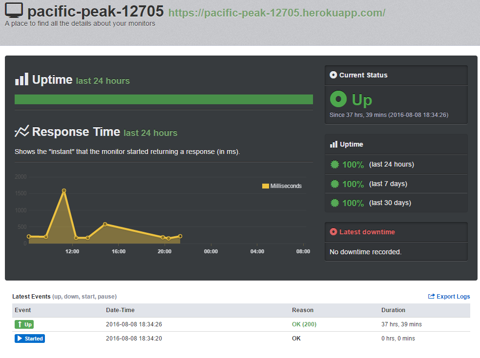

# Задание на настройку инфраструктуры проекта для ШРИ 2016

## Running Locally

Проект доступен по следующему тестовому URL: https://pacific-peak-12705.herokuapp.com/  
Ссылка на uptimerobot https://uptimerobot.com/dashboard.php#

## Логи

### Heroku slug-compiler

* Начало и конец (slug compilation), я так понял это отличается для разных платформ, т.е для npm ставится
npm зависимости, для ruby on rails gem и т.д.

### Heroku - api

* Номер релиза и автора ( Release v9 created by soloviev.dmitriy.serg@yandex.ru )
* Номер deploy и автор (Deploy ed0b51f by soloviev.dmitriy.serg@yandex.ru )

### Heroku - web.1

* Операция ( Restarting )
* Стартовый скрипт (Starting process with command `node index.js` )
* Состояние ( State changed from starting to up )

### App - web.1 

* Кастомные логи через (console.log) ( Calculator on port 29076 )

### Heroku Router - в процессе жизненного цикла в лог выводится запросы сделанные на сервер

> каждый запрос содержит следующую информацию 

* Тип сообщения at=info
* Описание ( desc="App crashed" )
* Метод и адрес и параметры ( method=GET path="/?arg1=2&arg2=3" )
* Хост (  host=pacific-peak-12705.herokuapp.com )
* Номер запроса ( request_id=eb70abcc-437d-4fd6-8934-28130f96d292 )
* IP адрес клиента ( fwd="87.245.145.34" )
* Имя dyno который обслуживает запрос ( dyno=web.1 ) dyno это процесс который обслуживает приложение
* Количество времени потраченное на создание соединения ( connect=1ms )
* Количество времени потраченное на proxying межде сервером и клиентом service=4ms
* Статус ( status=200 )
* Количество байт переданных клиенту bytes=805

### Uptimerbot - chart

